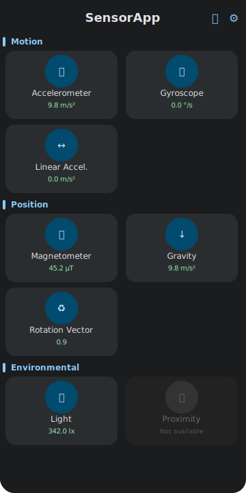
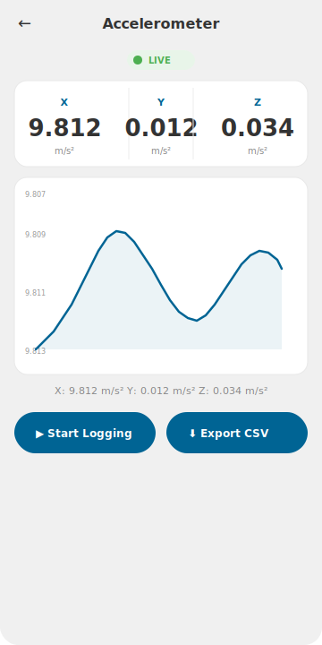
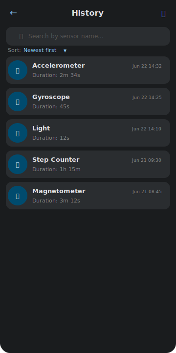
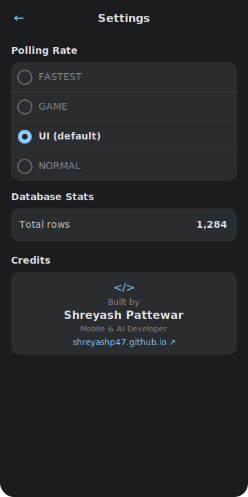

# SensorApp

Real-time Android sensor monitor. Displays live readings from all device sensors with animated values, scrolling charts, CSV export, and historical logging.

## Tech Stack

- **Language:** Kotlin
- **UI:** Jetpack Compose (Material 3)
- **Architecture:** Clean Architecture (data / domain / presentation)
- **DI:** Hilt
- **Async:** Kotlin Coroutines + Flow
- **Local DB:** Room
- **Navigation:** Compose Navigation
- **Build:** Gradle Version Catalog + KSP

## Sensors Supported

| Sensor | Type | Values |
|--------|------|--------|
| Accelerometer | 3-axis | X, Y, Z (m/s²) |
| Gyroscope | 3-axis | X, Y, Z (°/s) |
| Magnetometer | 3-axis | X, Y, Z (µT) |
| Light | 1-axis | lux |
| Proximity | 1-axis | cm |
| Barometer (Pressure) | 1-axis | hPa |
| Step Counter | 1-axis | steps |
| Gravity | 3-axis | X, Y, Z (m/s²) |
| Linear Acceleration | 3-axis | X, Y, Z (m/s²) |
| Rotation Vector | 3-axis | X, Y, Z |

## Screens

| Screen | Description |
|--------|-------------|
| **Dashboard** | Grid of all sensor cards. Available sensors show live values with a pulsing green LIVE dot. Unavailable sensors are greyed with a "Not available" chip. Tapping an unavailable sensor opens a bottom sheet explanation. |
| **Sensor Detail** | Large animated axis values with units, a live scrolling line chart (last 60 readings, Canvas-drawn), pulsing LIVE indicator, logging toggle, and CSV export to Downloads. |
| **History** | Lazy list of logged readings with filter chips by sensor type. "Clear older than 24h" action. |
| **Settings** | Polling rate selector (FASTEST / GAME / UI / NORMAL) and Room database stats. |

## Previews

| Dashboard | Sensor Detail | History | Settings |
|-----------|--------------|---------|----------|
|  |  |  |  |

## Key Features

- **Just-in-time permissions** — never requested at launch. Step Counter asks for `ACTIVITY_RECOGNITION` only when tapped (API 29+).
- **Lifecycle-aware** — sensor listeners are unregistered on `ON_STOP` and re-registered on `ON_START` to save battery.
- **Offline-first** — all readings logged to Room. CSV export via MediaStore (API 29+) with pre-Q fallback.
- **Unavailable sensor handling** — every sensor type is shown regardless of availability. Unavailable cards are greyed out with a red chip and show a bottom sheet explaining the missing sensor.

## Build

```bash
./gradlew :app:assembleDebug
```

Or open in Android Studio and run on a device/emulator.
