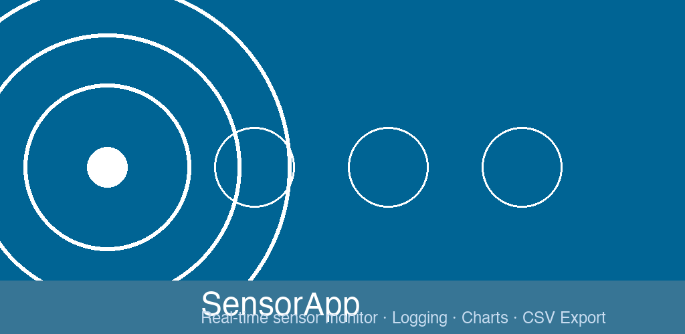
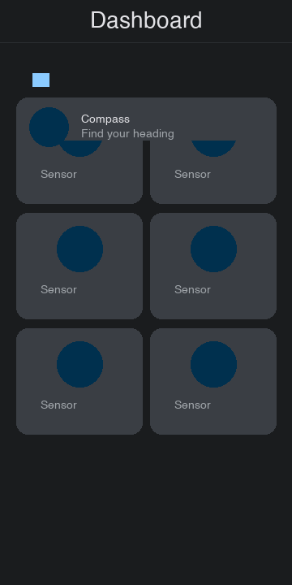
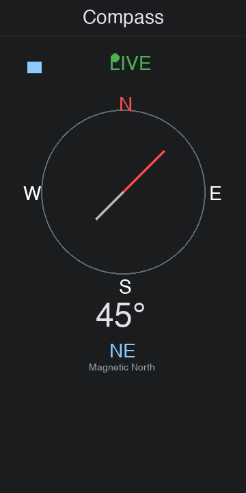
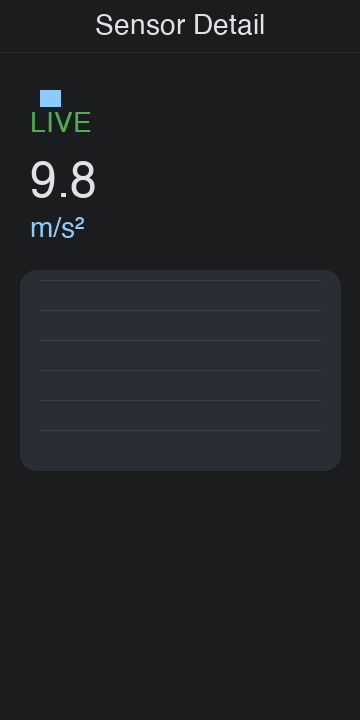
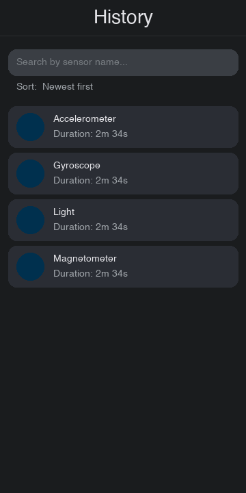
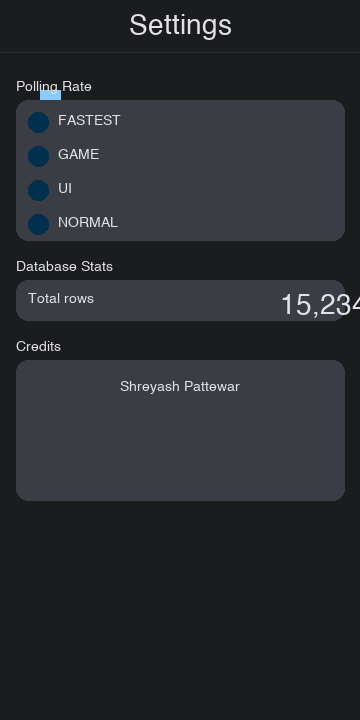

# SensorApp

<p align="center">
  
</p>

<p align="center">
  
</p>

Real-time Android sensor monitor. Live readings with scrolling charts, session-based logging, CSV export, and history tracking.

**Package:** `com.shreyash.sensorapp` · **Dark mode only** · **v1.7**

<p align="center">
  <a href="https://play.google.com/store/apps/details?id=com.shreyash.sensorapp">
    
  </a>
</p>

## Tech Stack

Kotlin · Jetpack Compose (Material 3) · Clean Architecture · Hilt · Room · Coroutines + Flow · Compose Navigation · Gradle Version Catalog + KSP

## Sensors Supported

| Sensor | Type | Values |
|--------|------|--------|
| Accelerometer | 3-axis | X, Y, Z (m/s²) |
| Gyroscope | 3-axis | X, Y, Z (°/s) |
| Magnetometer | 3-axis | X, Y, Z (µT) |
| Light | 1-axis | lux |
| Proximity | 1-axis | cm |
| Barometer | 1-axis | hPa |
| Step Counter | 1-axis | steps |
| Gravity | 3-axis | X, Y, Z (m/s²) |
| Linear Acceleration | 3-axis | X, Y, Z (m/s²) |
| Rotation Vector | 3-axis | X, Y, Z |

## Screens

| Screen | Description |
|--------|-------------|
| **Dashboard** | 2-column grid grouped by category (Motion, Position, Environmental, Activity). Each sensor is a card with a colored icon circle, name, and live value. Unavailable sensors are dimmed with "Not available" — tap opens a bottom sheet explanation. Includes a **Compass** feature card at the top. |
| **Compass** | Real-time tilt-compensated heading using accelerometer + magnetometer fusion. Canvas-drawn compass rose with cardinal/intercardinal labels, tick marks, and a diamond-shaped bicolor needle with smooth rotation animation. Digital heading display and direction name. |
| **Sensor Detail** | Live axis values with units, a Canvas-drawn line chart (last 60 readings) with gradient fill and Y-axis labels. Tap the chart for a crosshair + value tooltip. Start/Stop Logging toggles Room persistence. Export CSV button saves to Downloads. |
| **History** | One card per logging session (not individual readings) showing sensor icon, name, duration, and date. Search by sensor name, sort by newest/oldest/longest/shortest. Clear all with confirmation dialog. |
| **Settings** | Polling rate (FASTEST/GAME/UI/NORMAL), database row count, and credits (Shreyash Pattewar — Mobile & AI Developer). |

## Previews

| Dashboard | Compass | Sensor Detail | History | Settings |
|-----------|---------|--------------|---------|----------|
|  |  |  |  |  |

## Key Features

- **Compass** — tilt-compensated heading fusing accelerometer + magnetometer via `SensorManager.getRotationMatrix()`. Canvas-drawn rose with diamond needle and smooth animation.
- **Just-in-time permissions** — never at launch. Step Counter requests `ACTIVITY_RECOGNITION` only on tap (API 29+).
- **Lifecycle-aware** — sensor listeners unregistered on `ON_STOP`, re-registered on `ON_START`.
- **Session logging** — each Start→Stop creates a `LogSession` in Room. Navigating back while logging ends the session automatically.
- **In-memory chart** — last 60 readings buffered in memory; chart works even when logging is off.
- **CSV export** — uses `MediaStore.Downloads` (API 29+) with `Environment` fallback (pre-Q).
- **Touch-to-inspect chart** — tap any point on the line chart for crosshair + exact value tooltip.
- **Unavailable sensor handling** — every sensor shown regardless; unavailable cards are dimmed with explanation bottom sheet.

## Open Testing

This app is in open testing on Google Play. To help me get it to production:

1. **Join the tester group:** [google groups/testers-community](https://groups.google.com/g/testers-community)
2. **Install the app:** Once approved, install from the [Play Store listing](https://play.google.com/store/apps/details?id=com.shreyash.sensorapp)
3. **Report issues:** Open a [GitHub issue](https://github.com/shreyashp47/Sensor-App/issues)

Your feedback helps shape the production release!

## Build

```bash
./gradlew :app:assembleDebug
```

Or open in Android Studio and run on a device/emulator.
