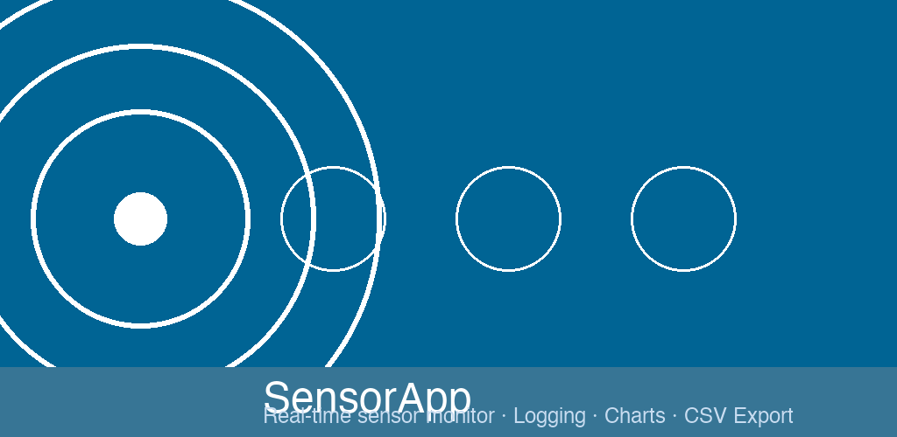
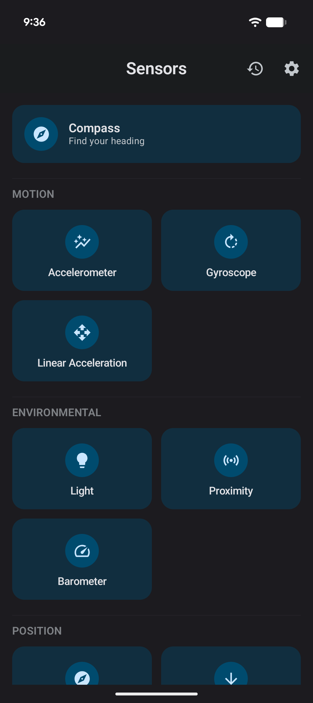
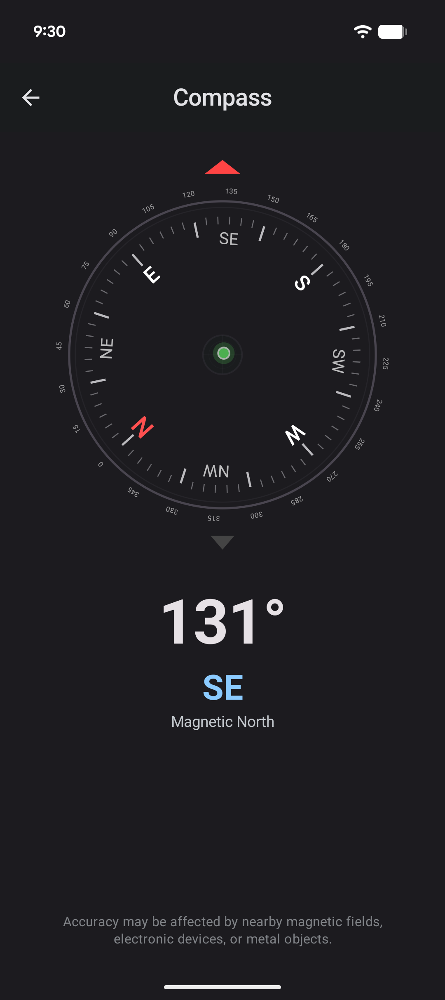
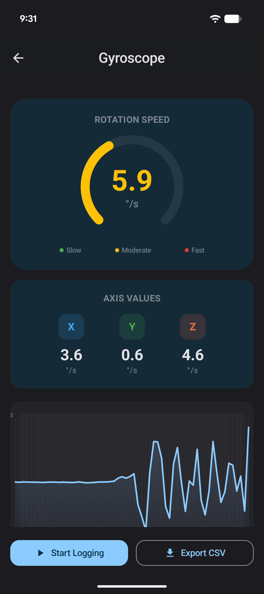
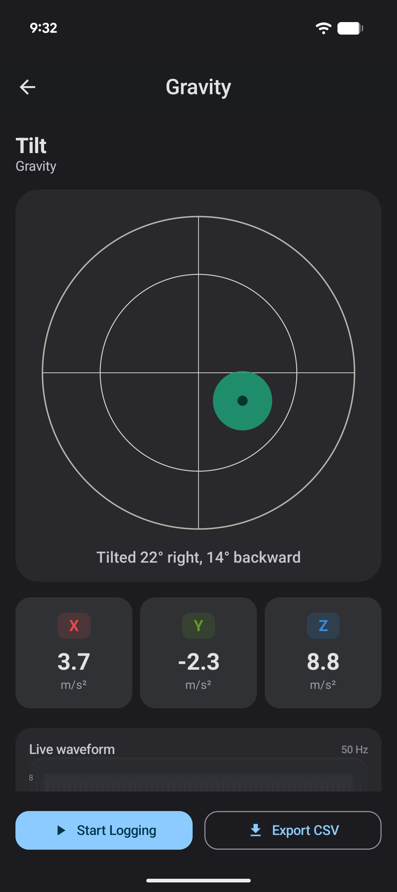
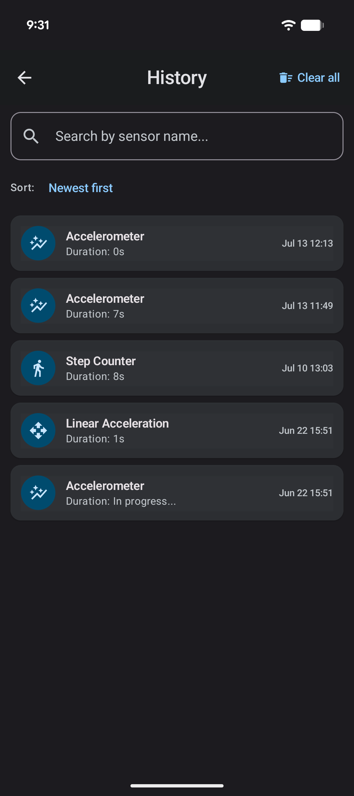

# SensorApp

<p align="center">
  
</p>

<p align="center">
  
</p>

Real-time Android sensor monitor. Live readings with scrolling charts, session-based logging, CSV export, and history tracking.

**Package:** `com.shreyash.sensorapp` · **Dark mode only** · **v1.19**

<p align="center">
  <a href="https://play.google.com/store/apps/details?id=com.shreyash.sensorapp">
    
  </a>
</p>

## Tech Stack

Kotlin 1.9.22 · Jetpack Compose (Material 3) · Clean Architecture · Hilt · Room · Coroutines + Flow · Compose Navigation · Gradle Version Catalog + KSP

## Sensors Supported (10)

| Sensor | Type | Category | Axes | Units |
|--------|------|----------|------|-------|
| Accelerometer | Hardware | Motion | 3 | m/s² |
| Gyroscope | Hardware | Motion | 3 | °/s |
| Linear Acceleration | Virtual | Motion | 3 | m/s² |
| Magnetometer | Hardware | Position | 3 | µT |
| Gravity | Virtual | Position | 3 | m/s² |
| Rotation Vector | Virtual | Position | 3 | — |
| Light | Hardware | Environmental | 1 | lx |
| Proximity | Hardware | Environmental | 1 | binary (OBSTRUCTED/CLEAR) |
| Barometer | Hardware | Environmental | 1 | hPa |
| Step Counter | Hardware | Activity | 1 | steps |

## Screens

| Screen | Description |
|--------|-------------|
| **Dashboard** | 2-column grid grouped by category (Motion, Position, Environmental, Activity). Each sensor is a card with a colored icon circle, name, and availability. Unavailable sensors are dimmed with "Not available" — tap opens a bottom sheet explanation. Includes a **Compass** card at the top. |
| **Compass** | Real-time tilt-compensated heading using accelerometer + magnetometer fusion. Canvas-drawn compass rose with degree labels and tick marks, smooth rotation animation, level indicator with animated tilt dot, and digital heading display. |
| **Sensor Detail** | One screen per sensor with unique visualizations — 3D gyroscope cube, brightness gradient bar (Light), weather condition card (Barometer), step counter, bubble level (Accelerometer) — plus live axis values and a multi-axis Canvas chart (last 60 readings). Tap the chart for a crosshair + value tooltip. Start/Stop Logging toggles Room persistence. Export CSV saves to Downloads. |
| **History** | One card per logging session showing sensor icon, name, duration, and date. Search by sensor name, sort by newest/oldest. Clear all with confirmation dialog. |
| **Settings** | Polling rate (FASTEST/GAME/UI/NORMAL), haptic feedback toggle, database stats, and credits (Shreyash Pattewar — Mobile & AI Developer). |

## Previews

| Dashboard | Compass | Gyroscope | Gravity | History |
|-----------|---------|-----------|---------|---------|
|  |  |  |  |  |

## Key Features

- **Compass** — tilt-compensated heading fusing accelerometer + magnetometer via `SensorManager.getRotationMatrix()`. Canvas-drawn rose with degree labels and smooth animation.
- **3D gyroscope cube** — Canvas-rendered cube that mirrors device rotation in real time.
- **Haptic feedback** — proximity transitions (`doubleTick`), step increments (`tick`), and high gyroscope rotation (`tick`). Toggle in Settings.
- **Just-in-time permissions** — never at launch. Step Counter requests `ACTIVITY_RECOGNITION` only on tap (API 29+).
- **Lifecycle-aware** — sensor listeners unregistered on `ON_STOP`, re-registered on `ON_START`.
- **Session logging** — each Start→Stop creates a `LogSession` in Room. Navigating back while logging ends the session automatically.
- **In-memory chart** — last 60 readings buffered in memory; chart works even when logging is off.
- **CSV export** — uses `MediaStore.Downloads` (API 29+) with `Environment` fallback (pre-Q).
- **Touch-to-inspect chart** — tap any point on the line chart for crosshair + exact value tooltip.
- **Unavailable sensor handling** — every sensor shown regardless; unavailable cards are dimmed with explanation bottom sheet.
- **Performance-aware dashboard** — no real-time observation on the dashboard grid; live values only on detail screens.

## Architecture

Clean Architecture with three layers:

```
data/         ← SensorDataSource (callbackFlow), Room DB, RepositoryImpl, HapticManager
domain/       ← Models (SensorType, SensorReading), Repository interface, UseCases
presentation/ ← Screens, ViewModels, Navigation, Theme
di/           ← Hilt modules (SensorModule, DatabaseModule)
```

**Data flow:** `SensorManager callbackFlow → SensorDataSource → SensorRepositoryImpl → ObserveSensorUseCase → DetailViewModel (60-reading buffer, haptics) → Compose UI (collectAsStateWithLifecycle)`

## CI/CD

GitHub Actions — lint on PR; on merge to `main` bumps version, builds a signed AAB, uploads to the Google Play beta track, and commits the version bump.

## Open Testing

This app is in beta on Google Play. To help me get it to production:

1. **Join the tester group:** [google groups/testers-community](https://groups.google.com/g/testers-community)
2. **Install the app:** Once approved, install from the [Play Store listing](https://play.google.com/store/apps/details?id=com.shreyash.sensorapp)
3. **Report issues:** Open a [GitHub issue](https://github.com/shreyashp47/Sensor-App/issues)

Your feedback helps shape the production release!

## Build

```bash
./gradlew :app:assembleDebug
```

Or open in Android Studio and run on a device/emulator.

## License

MIT — see [LICENSE](LICENSE).
